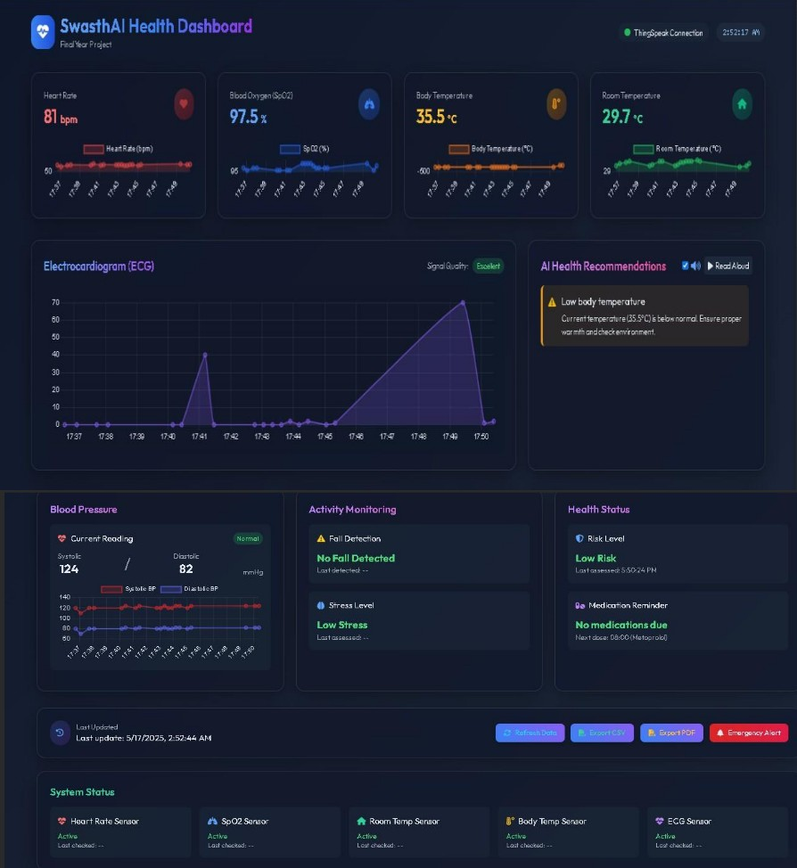
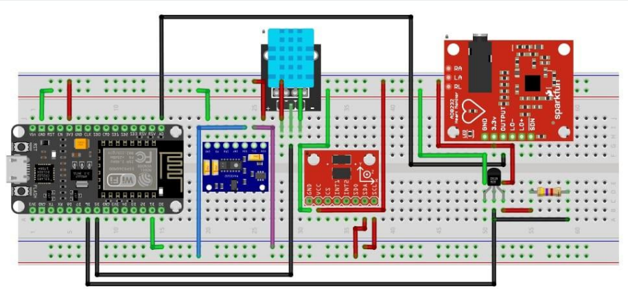
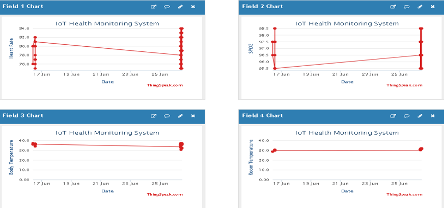

# 🩺 SwasthAI: An IoT and ML Based Health Monitoring Dashboard

SwasthAI is an intelligent healthcare monitoring system that integrates IoT sensors, Machine Learning, and a real-time web dashboard to monitor patient health parameters such as Heart Rate, SpO₂, Temperature, ECG, Stress Level, and Risk Level.

The system enables continuous remote health tracking and provides AI-powered recommendations using real-time analytics.

---

# ⚙️ Key Features

- 💓 Real-Time Vital Sign Monitoring
  - Heart Rate
  - SpO₂
  - ECG
  - Room Temperature
  - Body Temperature

- 🧠 ML-Based Predictions
  - Blood Pressure Estimation
  - Risk Level Detection
  - Stress Level Detection
  - Fall Detection

- ☁️ Cloud Integration
  - ThingSpeak data storage and visualization

- 📊 Interactive Dashboard
  - Live charts
  - Real-time metrics
  - Historical data visualization
  - Chart.js integration

- 🔊 Text-to-Speech (TTS)
  - Voice alerts for abnormal readings

- 🤖 AI Recommendations
  - Personalized health suggestions

- 🌙 Additional Features
  - Dark mode support
  - PDF/CSV export support
  - Responsive UI

---

# 🧩 Hardware Components

| Category | Components |
|---|---|
| Microcontroller | ESP8266 NodeMCU |
| Sensors | MAX30102, ADXL345, DHT11, DS18B20, AD8232 |
| Cloud Platform | ThingSpeak |
| Backend | Flask Server |
| ML Models | BP, Risk, Stress, Fall Detection |
| Frontend | HTML, CSS, JavaScript, Chart.js |

---

# 🧠 Machine Learning Workflow

1. Sensor data collected using ESP8266 and biomedical sensors  
2. Data pre-processing and normalization  
3. ML model inference using Flask backend  
4. Prediction results sent to dashboard and ThingSpeak  
5. Dashboard visualizes health metrics and recommendations

---

# 🗂️ Project Structure

```bash
SwasthAI/
│
├── app.py
├── models/
│   ├── bp_model.pkl
│   ├── risk_model.pkl
│   ├── stress_model.pkl
│   └── fall_model.pkl
│
├── templates/
│   └── index.html
│
├── screenshots/
│
├── requirements.txt
└── README.md
````

---

# 🖼️ Dashboard Preview



---

# 🏗️ System Architecture



### Data Flow

```text
Sensors → ESP8266 NodeMCU → Flask Server / ThingSpeak
        → ML Models → Dashboard + AI Recommendations
```

---

# 🔧 Sensor Setup


---

# 📈 ThingSpeak Visualization



---

# 🚀 How to Run the Project

## 1️⃣ Install Dependencies

```bash
pip install flask pandas numpy scikit-learn requests pyttsx3
```

## 2️⃣ Run Flask Server

```bash
python app.py
```

Server starts at:

```text
http://127.0.0.1:5000/
```

---

## 3️⃣ Configure ESP8266

Update:

* Wi-Fi SSID & Password
* Flask Server IP
* ThingSpeak API Key

Upload the code using Arduino IDE.

---

## 4️⃣ Open Dashboard

Open:

```text
index.html
```

in your browser to view live sensor data and ML predictions.

---

# 🔊 Example Voice Alerts

* ⚠️ “Heart rate is above normal range!”
* ✅ “SpO₂ level is stable.”
* 🩺 “Blood pressure within safe limit.”

---

# 🔮 Future Scope

* Mobile application support
* Doctor dashboard integration
* Emergency alert system
* Cloud database integration
* Wearable device support
* AI chatbot integration

---

# 👨‍💻 Author

## Manash Jyoti Mahanta

Electronics and Communication Engineering

Assam University Silchar

GitHub: [https://github.com/Tanmay0906](https://github.com/Tanmay0906)
